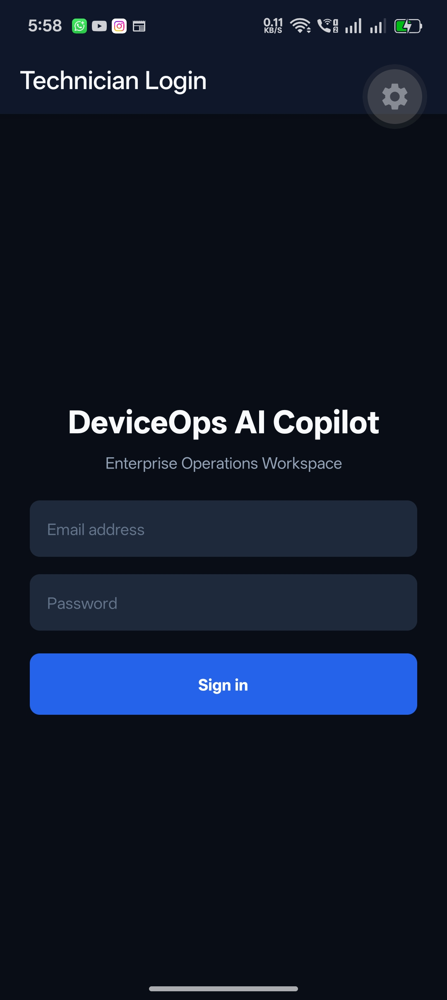
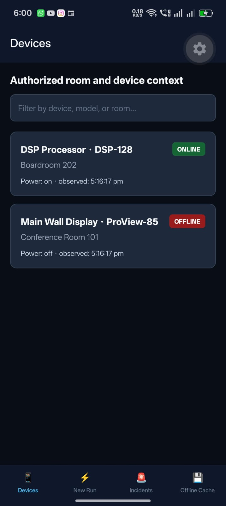
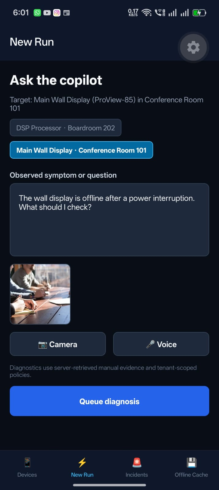
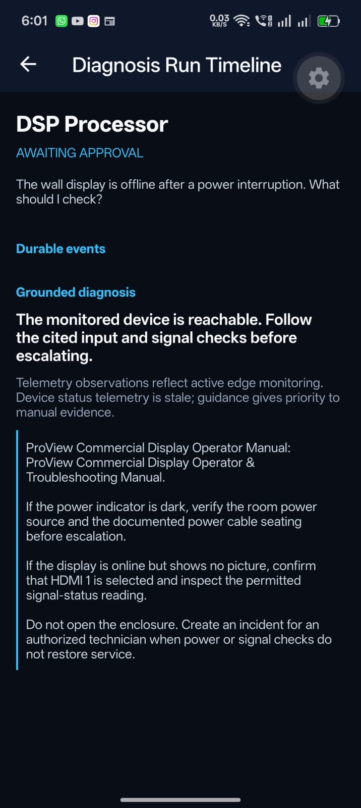
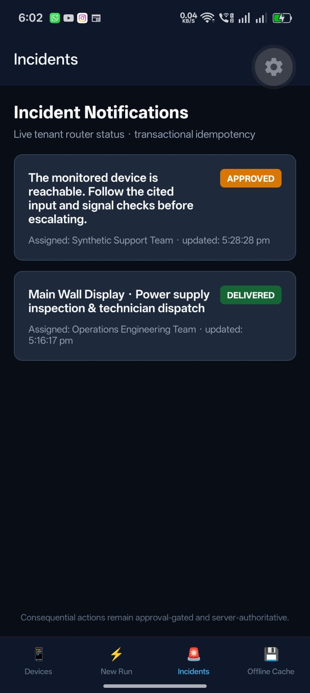
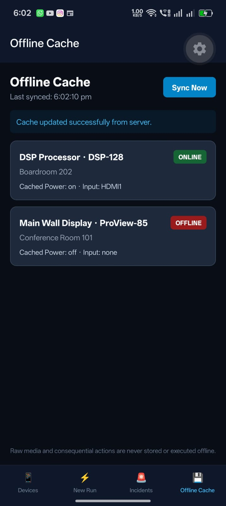

# DeviceOps Technician Mobile

Expo SDK 56 / TypeScript companion client for the DeviceOps AI Copilot platform.

> Source available for portfolio review; all rights reserved; no permission to reuse or redistribute.

The app uses the core API for mobile login, tenant-scoped device status, diagnosis creation, and reconnectable run polling. Access and refresh tokens are stored in Expo SecureStore. The server remains authoritative: the client never executes consequential actions offline, accepts model-supplied tenant IDs, or stores raw media in its offline cache.
 
## Connected Repositories

- 🖥️ **Core Monorepo**: [github.com/U7ama/deviceops-ai-copilot](https://github.com/U7ama/deviceops-ai-copilot) — Core Next.js 16 platform, pgvector RAG, pg-boss worker, and MCP adapter.
- 📱 **Mobile Companion App (`deviceops-mobile`)**: Current repository (Expo SDK 56 technician client with offline cache).
- ⚡ **Automations Adapter**: [github.com/U7ama/deviceops-automations](https://github.com/U7ama/deviceops-automations) — Version-controlled n8n incident workflows.

## Local run

1. Start the core web/API and worker from `deviceops-ai-copilot`.
2. Set `EXPO_PUBLIC_DEVICEOPS_API_URL` to a reachable machine URL. Android emulators use `http://10.0.2.2:3000`; a physical device needs the host's LAN address and a reachable firewall rule.
3. Install the pinned Expo SDK 56 dependencies and run `npm start`.

The local seeded password is intentionally not embedded in this repository. Use the password printed by the core seed command.

## Contract integrity

`npm run contracts:check` verifies the checked-in contract version and schema hash exported by the core repository. A stale companion manifest must fail CI before a mobile build is distributed.

## Mobile Application Tour

| Technician Login | Monitored Devices | Camera Diagnosis |
| :---: | :---: | :---: |
|  |  |  |

| Live Run Timeline & Citations | Incident Notifications | Offline Status Cache |
| :---: | :---: | :---: |
|  |  |  |

## Android smoke flow

`maestro/deviceops-smoke.yaml` is a human-readable Maestro flow for the physical-device path: launch the development build, sign in with the locally seeded account, inspect the monitored devices, queue a diagnosis, and open the durable run timeline. Run it from this repository after the core API and Metro server are reachable:

```bash
maestro test maestro/deviceops-smoke.yaml
```

Maestro is an external CLI and is not required for the TypeScript verification command. The flow is included as a reproducible test artifact; its execution must be recorded separately from the already verified manual Android run.

## Known boundary

Camera, audio recording, push notification, and cloud EAS credentials are adapters. The current runnable path is text-first with edge telemetry. A development APK has been installed and manually exercised on a physical Android device.

